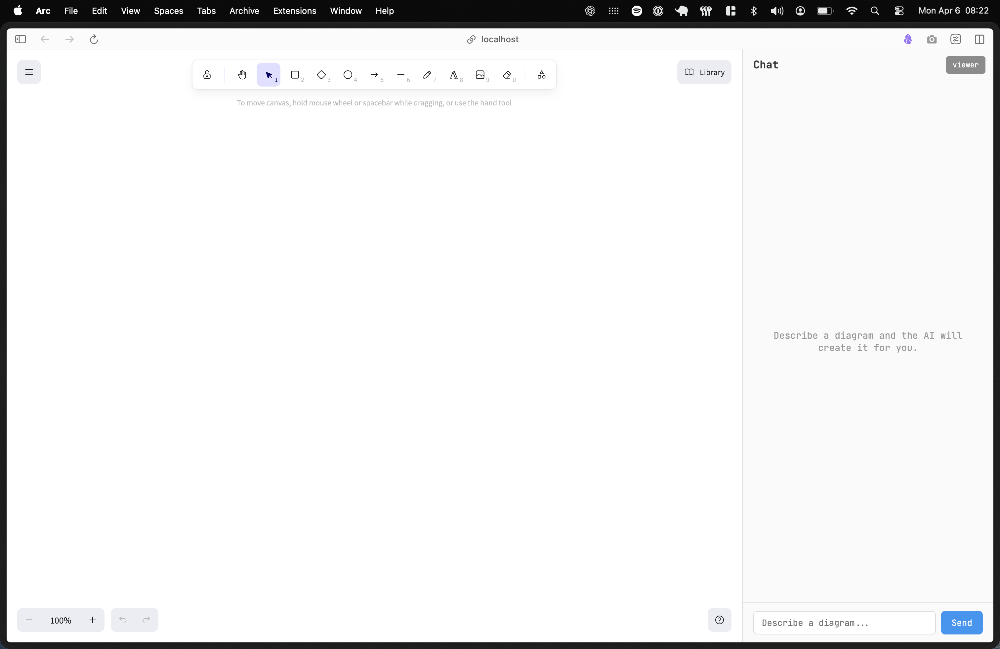

# Excalidraw Agent

An AI-powered diagramming workspace that turns natural-language requests into editable Excalidraw diagrams.

Ask the agent to create a flowchart, architecture diagram, sequence flow, or org chart. It can also inspect the current canvas and make targeted changes—adding nodes, moving or restyling shapes, changing labels, and removing elements without redrawing the rest of the diagram.

The project was inspired by https://github.com/Hendrixer/ai-engineering-fundamentals course.



## What it does

- Creates Excalidraw shapes and connections from a chat prompt.
- Reads the live canvas before modifying an existing diagram.
- Adds, updates, and removes individual elements through structured tool calls.
- Streams assistant text and tool progress into the chat panel.
- Searches the web through Tavily when a diagram needs current information.
- Retrieves reference material from a private Markdown corpus through Upstash Vector.
- Compacts long conversations while preserving recent context.
- Includes a Braintrust evaluation suite for diagram structure, schema validity, label coverage, and preservation of existing elements.
- Includes a standalone JSON diagram viewer for visually inspecting evaluation output.

The Excalidraw canvas remains the source of truth in the browser. The Cloudflare Worker runs the agent and emits structured drawing operations; the React client applies those operations to the live scene.

## Tech stack

- React 19, Vite, and Excalidraw
- Cloudflare Workers and Durable Objects
- Cloudflare Agents SDK and AI SDK
- OpenRouter (`openai/gpt-5.4-mini`)
- Tavily for web search
- Upstash Vector for retrieval-augmented generation
- Braintrust for evaluations

## Prerequisites

- Node.js 20 or newer
- An OpenRouter API key

Web search, knowledge retrieval, and evaluations require the corresponding optional service credentials described below.

## Setup

Install the dependencies:

```bash
npm install
```

Create a `.dev.vars` file in the project root:

```dotenv
OPENROUTER_API_KEY=sk-or-v1-...
OPENROUTER_BASE_URL=https://openrouter.ai/api/v1
OPENROUTER_MODEL=openai/gpt-5.4-mini

# Optional: enables current-information web search
TAVILY_API_KEY=tvly-...

# Optional: enables private-corpus search
UPSTASH_VECTOR_REST_URL=https://...upstash.io
UPSTASH_VECTOR_REST_TOKEN=...

# Optional: required only for `npm run eval`
BRAINTRUST_API_KEY=...
```

`OPENROUTER_MODEL` accepts any model identifier supported by the configured API
endpoint. For example:

- `openai/gpt-5.4-mini` (default)
- `qwen/qwen3.5-flash-02-23`

To use Qwen, set `OPENROUTER_MODEL=qwen/qwen3.5-flash-02-23` and restart the
development server.

`OPENROUTER_BASE_URL` is optional and defaults to
`https://openrouter.ai/api/v1`. Set it to another HTTP(S) URL when using an
OpenRouter-compatible proxy or gateway.

Start the development server:

```bash
npm run dev
```

Open the local URL printed by Vite, normally [http://localhost:5173](http://localhost:5173).

## Using the agent

Enter a request in the chat panel, for example:

```text
Draw an OAuth authorization-code flow with the browser, application,
authorization server, and API.
```

Follow-up requests operate on the existing canvas:

```text
Make the authorization server blue and add a cache between the API and database.
```

You can also edit the canvas directly with Excalidraw. When a later request requires existing state, the agent queries the browser for the current elements before applying its changes.

Chat sessions intentionally receive a new ID on every page load because the canvas itself is browser-local and is not restored after a refresh.

## Knowledge base

Reference documents live in [`data/corpus`](./data/corpus). To load them into an Upstash Vector index, configure the two Upstash variables and run:

```bash
npm run embed
```

The index must use an Upstash-hosted embedding model. The embed command resets the configured index before uploading every Markdown file in the corpus, so do not point it at an index containing unrelated data.

When a request concerns a technical system, protocol, process, or organizational structure, the agent can retrieve the most relevant corpus entries before drawing.

## Evaluations

The evaluation suite runs the same prompt, tools, model, and agent loop used by the application. It simulates the browser canvas in memory so creation and editing tasks can be scored without launching the UI.

Configure `OPENROUTER_API_KEY` and `BRAINTRUST_API_KEY`, then run:

```bash
npm run eval
```

Test cases are stored in [`evals/datasets/golden.json`](./evals/datasets/golden.json). Results are scored for:

- valid element schemas;
- expected diagram structure;
- important label keywords; and
- preservation of pre-existing canvas elements.

For human review, open `/#viewer` (or click **viewer** in the lower corner of the app) and paste either a raw element array or an object containing an `elements` array.

## Other commands

| Command | Purpose |
|---|---|
| `npm run dev` | Run the React app and Cloudflare Worker locally |
| `npm run build` | Create a production build |
| `npm run preview` | Preview the production build locally |
| `npm run agent -- "draw a flowchart"` | Send a prompt over WebSocket while the dev server is running on port 5173 |
| `npm run embed` | Reset and rebuild the Upstash knowledge index |
| `npm run eval` | Run the Braintrust evaluation suite |

## Architecture

1. The React client connects to a per-page `DesignAgent` Durable Object and sends chat messages.
2. The Worker streams an OpenAI response with canvas, web-search, and knowledge-search tools available.
3. `queryCanvas` is fulfilled in the browser against the live Excalidraw scene.
4. Drawing tools return validated element operations to the client.
5. The client converts those operations into Excalidraw elements and applies them to the scene.

The shared agent implementation in [`src/agent-core.ts`](./src/agent-core.ts) is used by both the live Worker and the evaluation harness, reducing drift between tested and runtime behavior.
